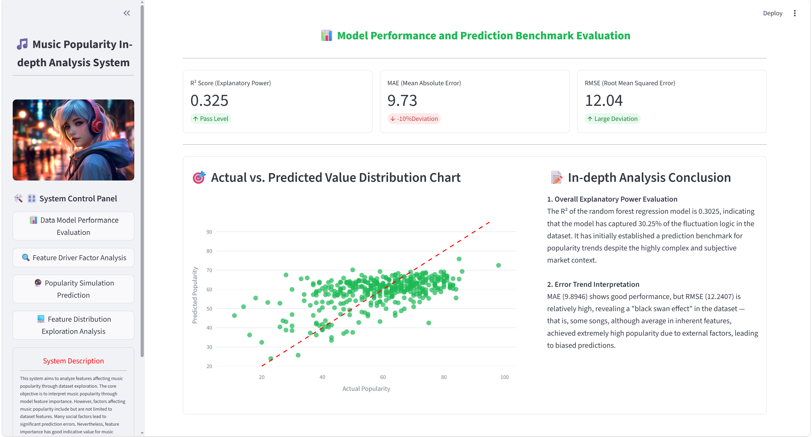
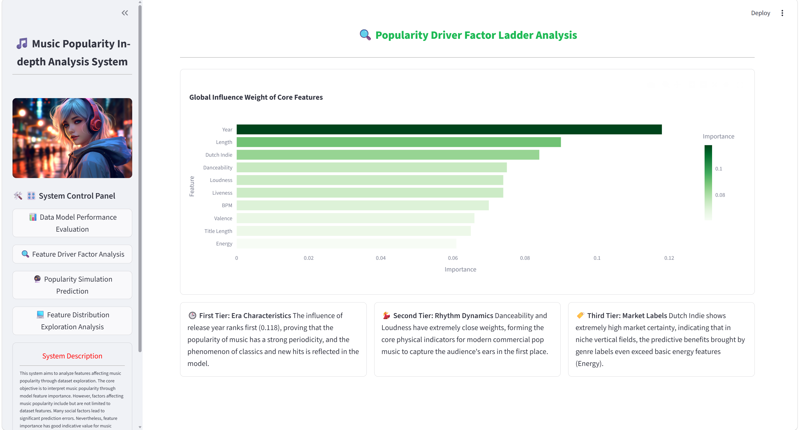
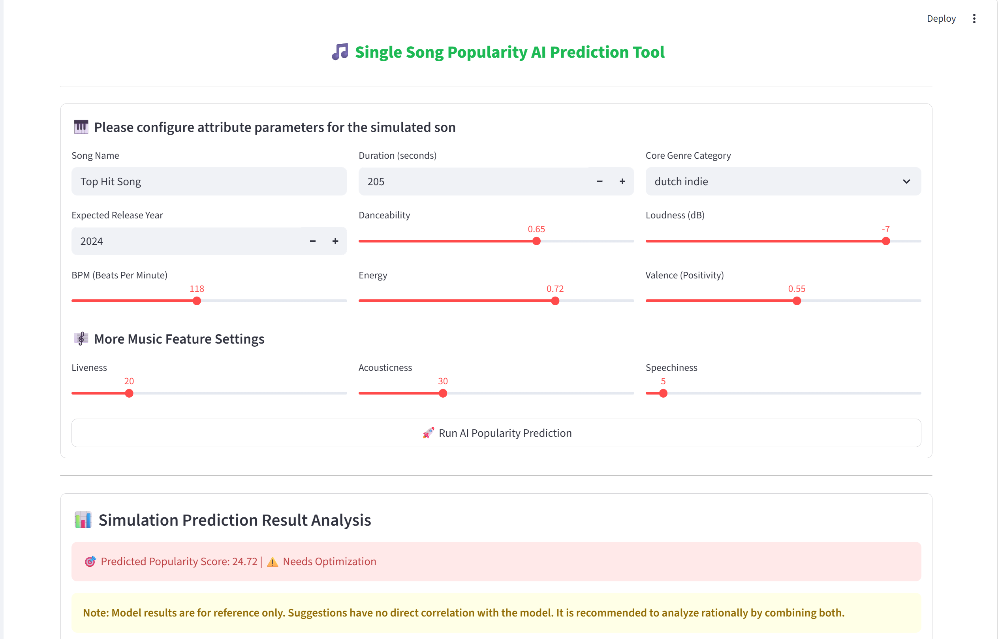
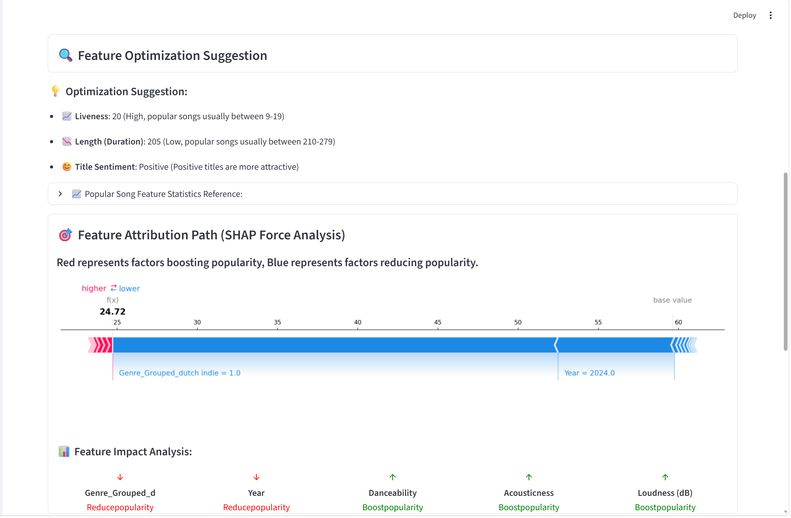
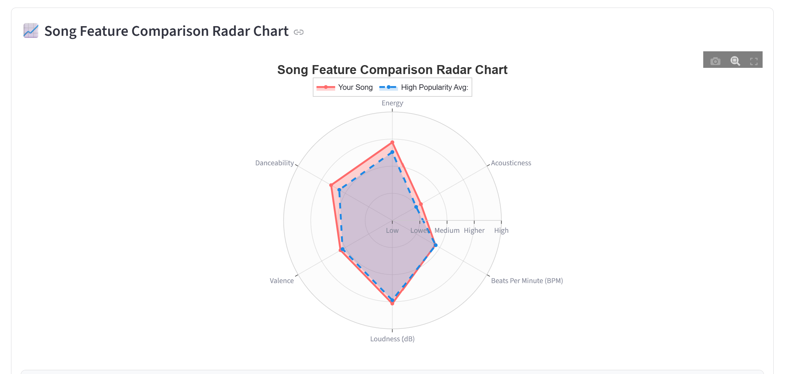
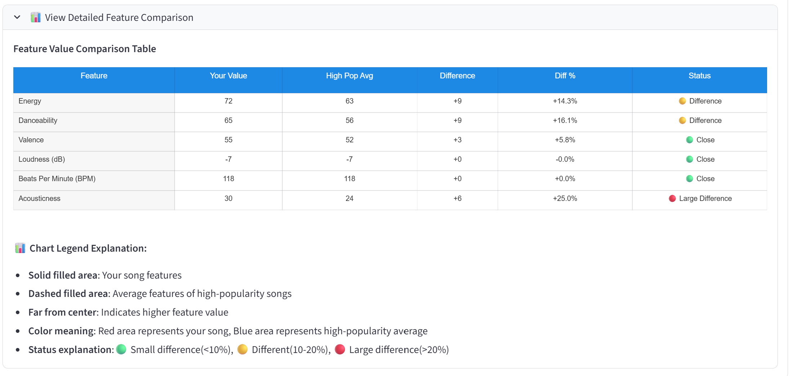
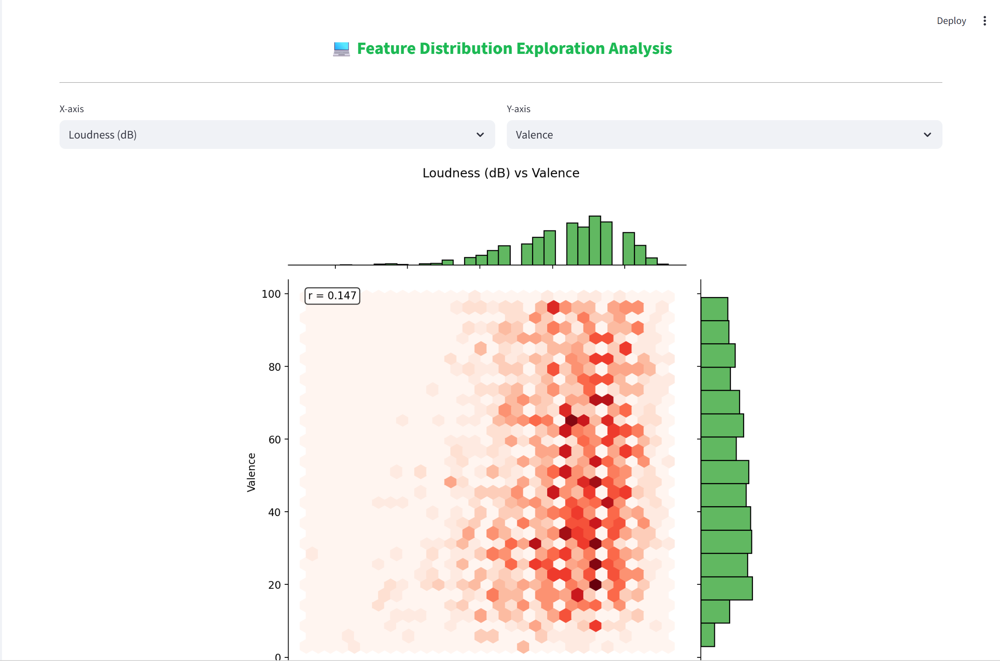

# Music Popularity Prediction Assistant

A machine learning-based tool that predicts song popularity using audio features and provides actionable optimization suggestions for music creators.

## Demo


*Model performance dashboard with R², MAE, RMSE metrics and actual vs. predicted scatter plot*


*Global influence weight of core features with three-tier categorization*


*Interactive prediction tool with parameter sliders and optimization suggestions*


*Optimization recommendations and SHAP Force Plot for feature attribution*


*Feature comparison between your song and high-popularity songs*


*Numerical comparison table with percentage differences*


*Hexbin plots for visualizing feature relationships*

## Project Overview

This project develops a Random Forest regression model to predict song popularity scores based on audio features from Spotify's Top 2000s dataset. The trained model is deployed as a Streamlit application with real-time prediction and benchmarking capabilities.

**Target Users**: Independent music producers, A&R departments, music marketing teams

**Core Features**:
- Popularity prediction based on audio features
- Optimization suggestions with benchmark gaps
- Feature comparison via radar charts
- SHAP-based interpretability

## Features

- **Data Model Performance Evaluation** - View R², MAE, RMSE metrics and prediction scatter plot
- **Feature Driver Factor Analysis** - Understand which audio features drive popularity predictions with tier analysis
- **Popularity Simulation Prediction** - Input your song features via sliders and get instant predictions with optimization suggestions
- **Feature Distribution Exploration** - Visualize relationships between different audio features with hexbin plots

## Tech Stack

### Core Libraries
- Python 3.9+
- pandas 2.3.3 - Data manipulation and analysis
- numpy 1.26.4 - Numerical computing
- scikit-learn 1.3.2 - Machine learning (Random Forest)
- scipy 1.15.3 - Scientific computing

### Visualization
- matplotlib 3.10.8 - Static visualization
- seaborn - Statistical visualization
- plotly - Interactive visualization
- altair 6.0.0 - Declarative visualization
- pydeck 0.9.1 - Geospatial visualization

### Web Application
- streamlit 1.53.0 - Web application framework
- tornado 6.5.5 - Asynchronous networking
- watchdog 6.0.0 - File system monitoring

### Machine Learning & Interpretability
- shap 0.49.1 - Model interpretation
- numba 0.65.0 - JIT compilation
- joblib 1.5.3 - Model serialization

### Natural Language Processing
- nltk 3.8.1 - Natural language processing

### Data Processing
- pyarrow 23.0.1 - Columnar data format
- pillow 12.2.0 - Image processing

### Utilities
- requests 2.33.1 - HTTP library
- GitPython 3.1.46 - Git repository access
- Jinja2 3.1.6 - Template engine
- tqdm 4.67.3 - Progress bars

## Dataset

**Source**: [Spotify Top 2000s Mega Dataset](https://www.kaggle.com/datasets/iamsumat/spotify-top-2000s-mega-dataset)

**Records**: 1,994 songs

**Features**: 15 columns including:
- Audio features: BPM, Energy, Danceability, Loudness, Valence, Acousticness, Speechiness, Liveness, Duration
- Metadata: Year, Genre, Artist, Title
- Target: Popularity (11-100 scale)

## Quick Start for Instructors

Follow these steps to run the application locally after cloning the repository.

### Step 1: Clone the Repository

Open your terminal or command prompt and run:

```bash
git clone https://github.com/IFalexa/songs-popularity-predictor.git
cd songs-popularity-predictor
```

Alternatively, download the ZIP file from GitHub by clicking "Code" → "Download ZIP".

### Step 2: Verify Python Version

This project requires Python 3.9 or higher. Check your Python version:

```bash
python --version
```

If you have multiple Python versions, use:

```bash
python3 --version
```

If Python is not installed, download it from https://www.python.org/downloads/

### Step 3: Create Virtual Environment (Recommended)

Creating a virtual environment avoids dependency conflicts:

```bash
# Create virtual environment
python -m venv venv

# Activate virtual environment
# On Windows:
venv\Scripts\activate

# On macOS/Linux:
source venv/bin/activate
```

You should see `(venv)` in your terminal prompt after activation.

### Step 4: Install Dependencies

Install all required packages:

```bash
pip install -r requirements.txt
```

This will install all dependencies including:
- **Core**: streamlit==1.53.0, pandas==2.3.3, numpy==1.26.4, scikit-learn==1.3.2, scipy==1.15.3

**Note**: If installation is slow (common for users in China), use the Tsinghua mirror to accelerate:

```bash
pip install -r requirements.txt -i https://pypi.tuna.tsinghua.edu.cn/simple
```
- **Visualization**: matplotlib==3.10.8, seaborn, plotly, altair==6.0.0, pydeck==0.9.1
- **ML & Interpretability**: shap==0.49.1, numba==0.65.0, joblib==1.5.3
- **NLP**: nltk
- **Data Processing**: pyarrow==23.0.1, pillow==12.2.0
- **Utilities**: requests==2.33.1, GitPython==3.1.46, Jinja2==3.1.6, tqdm==4.67.3, tornado==6.5.5, watchdog==6.0.0
- **Supporting Libraries**: altair, attrs, blinker, cachetools, certifi, charset-normalizer, click, cloudpickle, colorama, contourpy, cycler, fonttools, gitdb, idna, jsonschema, kiwisolver, llvmlite, MarkupSafe, narwhals, packaging, protobuf, pyparsing, python-dateutil, pytz, referencing, rpds-py, six, slicer, smmap, tenacity, threadpoolctl, toml, typing_extensions, tzdata, urllib3

### Step 5: Run the Application

Start the Streamlit application:

```bash
streamlit run app.py
```

The application will automatically open in your default browser at http://localhost:8501

If the browser doesn't open automatically, manually navigate to the URL shown in the terminal.

## Troubleshooting & Common Issues

### Issue 1: "streamlit: command not found"

**Solution:** Install Streamlit globally or use the full path:

```bash
python -m streamlit run app.py
```

### Issue 2: ModuleNotFoundError for specific packages

**Solution:** Install the missing package individually:

```bash
pip install streamlit
pip install pandas
pip install scikit-learn
pip install shap
pip install nltk
```

### Issue 3: SHAP import error on Windows

**Solution:** SHAP requires Visual C++ Build Tools. Install it from:
https://visualstudio.microsoft.com/visual-cpp-build-tools/

Or use a pre-compiled version:

```bash
pip install shap --no-binary shap
```

### Issue 4: Python version compatibility

**Minimum Required:** Python 3.9

If you encounter compatibility issues with newer Python versions (3.11+), try:

```bash
pip install --upgrade pip setuptools wheel
pip install -r requirements.txt
```

### Issue 5: Permission denied when saving model files

**Solution:** Close any programs that might be using the .pkl files, or save with a different filename:

```python
joblib.dump(model, 'model_new.pkl', compress=3)
```

### Issue 6: NLTK data not found

**Solution:** Download required NLTK data:

```python
import nltk
nltk.download('vader_lexicon')
```

### Issue 7: Virtual environment activation fails on Windows

**Solution:** Enable PowerShell script execution:

```powershell
Set-ExecutionPolicy -ExecutionPolicy RemoteSigned -Scope CurrentUser
```

Then try activating again:

```bash
venv\Scripts\activate
```

### Issue 8: Plotly visualization not rendering

**Solution:** Ensure plotly is installed:

```bash
pip install plotly
```

## Methodology

### Data Processing Pipeline
1. Data Cleaning: Handle missing values, duplicates, outliers using IQR-based detection
2. Feature Engineering: Artist encoding (830+ unique), Genre grouping (100+ categories), Title sentiment analysis
3. Train/Test Split: 80/20 ratio
4. Model Training: Random Forest with GridSearchCV hyperparameter tuning
5. Evaluation: R², MAE, RMSE metrics

### Why Random Forest?
- Captures non-linear relationships in audio features
- Resistant to overfitting compared to single decision trees
- Provides interpretable feature importance scores
- Outperformed simpler models (Linear Regression: 55%, Decision Tree: 49%) in cross-validation

## Model Performance

**R² Score**: 0.325

**MAE**: 9.74

**RMSE**: 12.04

**Interpretation**: The model explains 32.5% of popularity variance, with predictions averaging ±10 points error. RMSE > MAE indicates presence of prediction outliers - some songs with average features became viral hits, while others with strong features underperformed.

### Feature Importance (Top 10)

1. **Year** (11.8%) - Temporal trends and streaming era effects
2. **Length/Duration** (9.0%) - Shorter songs preferred in streaming era
3. **Genre: Dutch Indie** (8.5%) - Regional bias indicator
4. **Danceability** (7.5%) - Rhythm and groove importance
5. **Liveness** (7.5%) - Live performance presence
6. **Loudness** (7.4%) - Production quality indicator
7. **BPM** (7.1%) - Tempo impact
8. **Valence** (6.6%) - Emotional positivity
9. **Title Length** (6.6%) - Memorability factor
10. **Energy** (6.2%) - Song energy level

**Key Insights**:
- Release year is the strongest predictor (11.8% importance)
- Genre plays significant role, especially niche genres
- Audio features (Danceability, Loudness, BPM) collectively drive popularity
- Duration optimization: shorter songs preferred in streaming era

## Streamlit Application

The application consists of 4 interactive modules:

### 1. Model Performance Dashboard
- Display R², MAE, RMSE metrics with status indicators
- Actual vs. Predicted scatter plot with diagonal reference line
- Deep analysis conclusions on model performance

### 2. Feature Driver Analysis
- Global influence weight bar chart of all features
- Three-tier feature categorization:
  - First Tier: Era Characteristics (Year)
  - Second Tier: Rhythm Dynamics (Danceability, Loudness, BPM, Valence)
  - Third Tier: Market Labels (Genre patterns)

### 3. Popularity Prediction
- Input audio features via sliders (BPM, Energy, Danceability, etc.)
- Get instant popularity score prediction
- Compare with top songs benchmark via radar chart
- Receive optimization suggestions based on gaps
- SHAP Force Plot for feature attribution
- Detailed feature value comparison table

### 4. Feature Distribution
- Hexbin plots for feature relationship visualization
- Interactive X-axis and Y-axis selection
- Correlation coefficient display
- Distribution histograms for both axes
- Identify optimal feature ranges for high popularity

## Model Details

**Algorithm**: Random Forest Regressor

**Hyperparameters**:
- n_estimators: 350
- max_depth: 14
- min_samples_leaf: 2
- max_features: None
- random_state: 42

**Training Data**: 1,595 songs (80%)

**Test Data**: 399 songs (20%)

### Use Pre-trained Model

The repository includes a pre-trained Random Forest model that can be loaded directly:

```python
import joblib
model = joblib.load('music_popularity_rf(1).pkl')
feature_columns = joblib.load('feature_columns(1).pkl')
```

## Limitations

**Data Limitations**:
- Limited to songs from 1956-2019
- Missing contemporary features (streams, playlists, social media metrics)
- Genre distribution skewed towards certain categories
- Does not include lyrics or music video features
- Geographic bias (Dutch Indie's high weight indicates Netherlands-centric composition)

**Model Limitations**:
- R² of 0.325 indicates significant unexplained variance
- Cannot capture viral/meme-driven popularity
- Regional popularity differences not considered
- Artist reputation and marketing budget not factored
- Feature importance cannot distinguish correlation direction

## Future Improvements

**Short-term**:
- Add more recent songs (2020-2024)
- Include streaming platform features (playlists, skip rates)
- Experiment with ensemble models (XGBoost, LightGBM)
- Add cross-validation for more robust evaluation
- Create popularity-tiered visualizations

**Long-term**:
- Deploy as web service API
- Add real-time Spotify integration
- Incorporate lyrical analysis (NLP)
- Include artist popularity and social media metrics
- Build recommendation engine based on similarity
- Expand dataset beyond Netherlands-centric samples

## Project Structure

```
songs-popularity-predictor/
├── app.py                                 # Main Streamlit application
├── train_model.py                         # Model training script
├── Music Popularity Prediction.ipynb      # Jupyter Notebook with analysis
├── music_popularity_rf(1).pkl             # Trained Random Forest model
├── feature_columns(1).pkl                 # Feature column names
├── test.pkl                               # Test data for evaluation
├── Spotify-2000.csv                       # Dataset from Kaggle
├── requirements.txt                       # Python dependencies
├── README.md                              # This documentation
├── demo_1.png                             # Model performance screenshot
├── demo_2.png                             # Feature importance screenshot
├── demo_3.png                             # Prediction tool screenshot
├── demo_4.png                             # Optimization suggestions screenshot
├── demo_5.png                             # Radar chart screenshot
├── demo_6.png                             # Comparison table screenshot
└── demo_7.png                             # Feature distribution screenshot
```

## Running the Jupyter Notebook

To explore the data analysis process:

```bash
jupyter notebook "Music Popularity Prediction.ipynb"
```

Or if using JupyterLab:

```bash
jupyter lab "Music Popularity Prediction.ipynb"
```

The notebook contains:
1. Problem Definition & Business Context
2. Data Overview & Cleaning
3. Exploratory Data Analysis (EDA)
4. Feature Engineering
5. Model Building with GridSearchCV
6. Model Evaluation & Feature Importance Analysis
7. Business Insights & Product Design
8. Limitations & Future Work
9. Reflection

## System Requirements

- Operating System: Windows 10+, macOS 10.14+, or Linux
- Python: 3.9 or higher (tested on Python 3.9)
- RAM: 4GB minimum (8GB recommended)
- Disk Space: 500MB for dependencies

## Additional Resources

- Streamlit Documentation: https://docs.streamlit.io/
- scikit-learn Documentation: https://scikit-learn.org/stable/
- SHAP Documentation: https://shap.readthedocs.io/
- Dataset Source: https://www.kaggle.com/datasets/iamsumat/spotify-top-2000s-mega-dataset

## Author

Yifei Jiang

## License

Results are for reference only; not applicable for major decision-making!!! This project is for educational purposes only.

## Acknowledgments

- **Dataset Source**: Kaggle Spotify Top 2000s Mega Dataset
- **Model**: Random Forest Regression with GridSearchCV hyperparameter tuning
- **Web Framework**: Streamlit 1.53.0
- **Visualization**: matplotlib 3.10.8, seaborn, plotly, altair 6.0.0, pydeck 0.9.1
- **Model Interpretation**: SHAP 0.49.1
- **Machine Learning**: scikit-learn 1.3.2, scipy 1.15.3, numba 0.65.0
- **Data Processing**: pandas 2.3.3, numpy 1.26.4, pyarrow 23.0.1
- **Natural Language Processing**: nltk 3.8.1
- **Model Serialization**: joblib 1.5.3
- **HTTP & Networking**: requests 2.33.1, tornado 6.5.5, urllib3 2.6.3
- **Template Engine**: Jinja2 3.1.6
- **Progress Tracking**: tqdm 4.67.3
- **File Monitoring**: watchdog 6.0.0
- **Image Processing**: pillow 12.2.0
- **Git Integration**: GitPython 3.1.46
- **All Supporting Libraries**: altair, attrs, blinker, cachetools, certifi, charset-normalizer, click, cloudpickle, colorama, contourpy, cycler, fonttools, gitdb, idna, jsonschema, kiwisolver, llvmlite, MarkupSafe, narwhals, packaging, protobuf, pyparsing, python-dateutil, pytz, referencing, rpds-py, six, slicer, smmap, tenacity, threadpoolctl, toml, typing_extensions, tzdata
